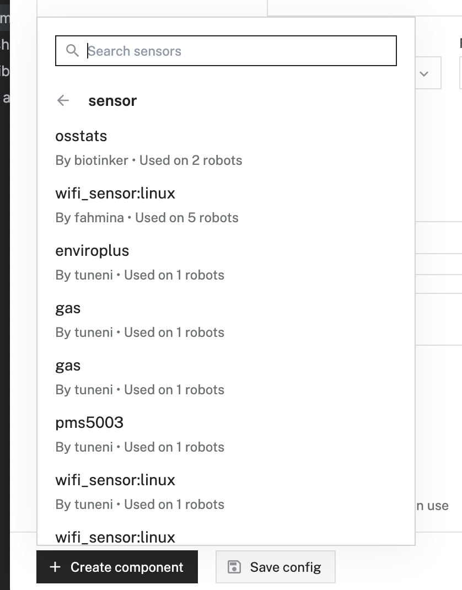
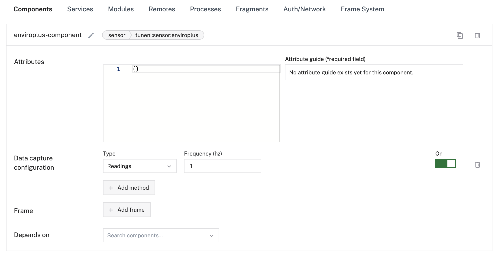
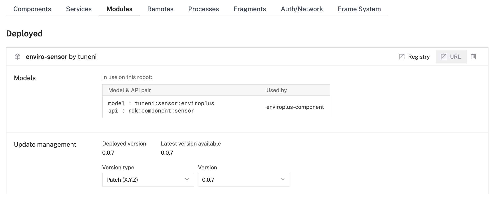
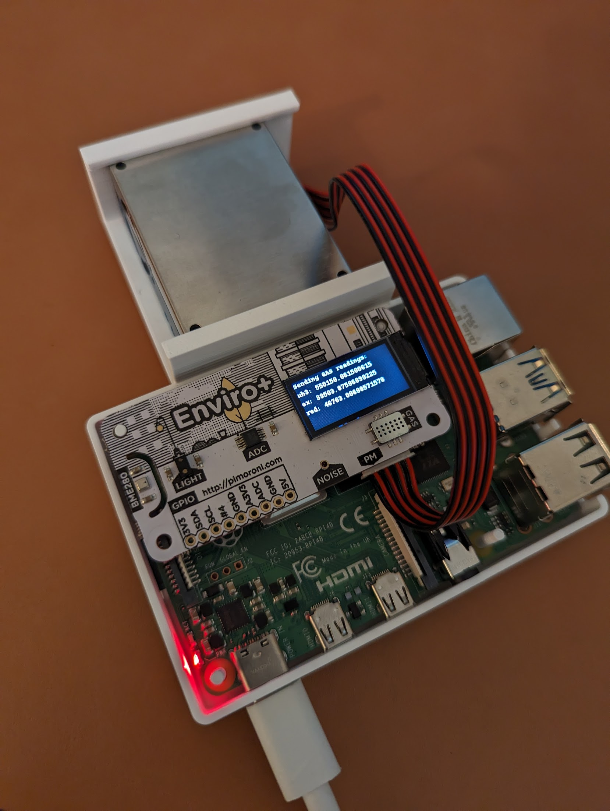
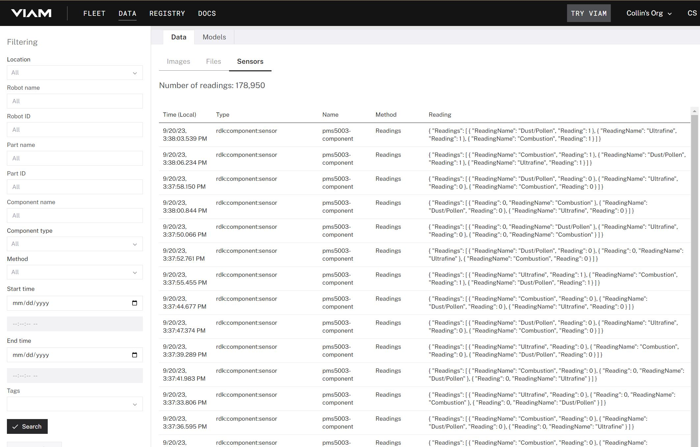
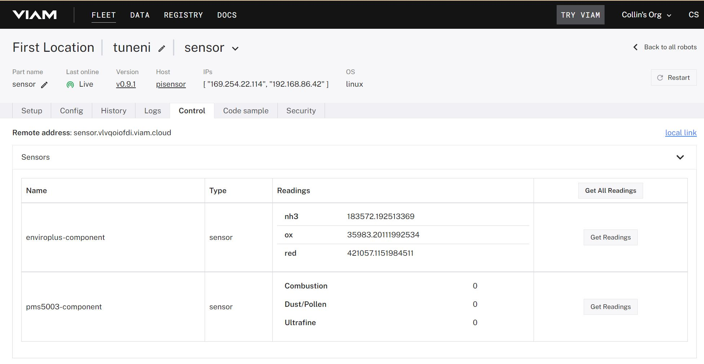

# Enviroplus Viam Sensor Module

This repo used the Viam example sensor module to create a Python sensor for use in Viam robots. The sensor is like this one: https://shop.pimoroni.com/products/enviro?variant=31155658457171. We use the enviroplus Python library: https://github.com/pimoroni/enviroplus-python.

The current code is only collecting the readings from the MICS6814 analog gas sensor and reports the values for NH3, oxidising, and reducing readings. This was our first interest, but it should be fairly straightforward to add readings from the other sensors with small changes.

## Creating a new Viam module in the Viam registry

This section details how to create a new Viam module using their registry. If you just want to use the existing
module from the registry, you can skip this section.

1. Inside the repo, use the Viam CLI to create a meta.json template and register the module in the Viam registry/

```bash
viam module create --name "enviro-sensor" --public-namespace "tuneni"
```
2. Once this is created, you need to update the `meta.json` to have the relevant fields as follows:
```json
{
  "module_id": "tuneni:gas-test",
  "visibility": "public",
  "url": "https://github.com/azbones/gas_sensor",
  "description": "This is the mddule that uses the enviroplus lib and pi hat to collect gas readings.",
  "models": [
    {
      "api": "rdk:component:sensor",
      "model": "tuneni:sensor:enviroplus"
    }
  ],
  "entrypoint": "exec.sh"
}
```
3. Next, you need to update the registry with:
```bash
viam module update
```
Then, you need to tar the files Viam needs to deploy on the robot as follows. Note that you will have to make sure the file permissions allow the shell scripts and python scripts to be executed.
```bash
chmod 755 *.sh ./src
tar -czf module.tar.gz exec.sh requirements.txt src .env setup.sh
```
5. Then, you need to upload the file tar along with a version and platform which matches the OS of the robot for this file package:
```bash
viam module upload --version "0.0.1" --platform "linux/arm64" module.tar.gz
```

## Using the module from the Viam registry

1. Next, to "deploy" the module to the robot, you go to the Viam app and create a new sensor component from the Viam registry. Note that the registry often does not display the updated sensor, so you may have to reload the page. A direct link is also here- https://app.viam.com/module/tuneni/enviro-sensor




2. To set up the data collection, you need to configure the data capture configuration as shown below:




3. The module should be configured and available using the most recent version. This will look like the following:




4. If this is configured correctly, you should see a final message in the robot log like the following:

```
2023-09-20T21:47:24.257Z info robot_server.process.tuneni_pms5003-sensor_/root/.viam/packages/.data/module/8754658a-ccc0-4bab-8fd5-2dcd888d6b04-pms5003-sensor-0_0_3/exec.sh.StdOut   pexec/managed_process.go:224   \_ 2023-09-20 22:47:24,257 INFO viam.rpc.server (server.py:111) Serving on /tmp/viam-module-1486850233/tuneni_pms5003-sensor.sock 
```

5. Given the enviroplus hat has a small LCD screen, this code prints a message to this screen each time the `get_readings` function is called. This is is what that looks like:



6. Finally, there are at least three ways to get the data if the robot is on and sending data. First, if the data collection function is configured and turned on via the component "data capture configuration", you can go to the Data tab at the top of the Viam app to see the following:



You can also navigate to the "control" tab for the robot to call the get_readings API via the UI like this:



Finally, you can use the API via the client sdks. I will post more about that as I make progress.

### Set a secret if you want to use Github CI

Instructions for setting the secret are [here](https://github.com/viamrobotics/upload-module#setting-cli-config-secret).

